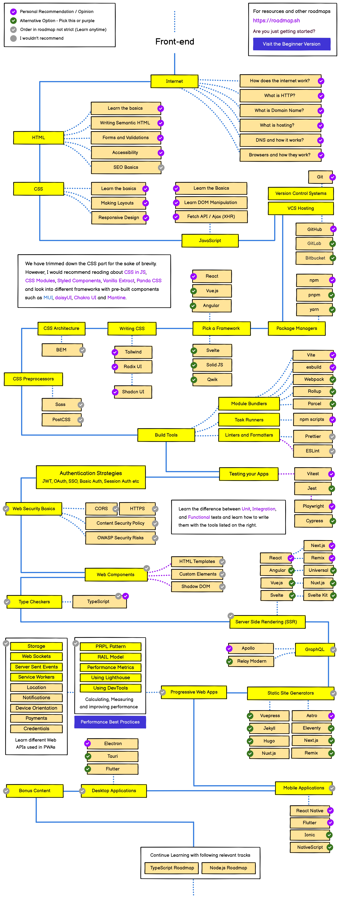

# SES-Web-Developer-Mentorship
The Website Mentorship is a 3-month intensive program for aspiring web developers. It covers HTML, CSS, and JavaScript, fostering skills in front-end development, web design, and hosting. It includes code reviews and collaborative projects, led by the Society of Engineering Society.
# Roadmap

# Course Outline

**Module 1: Foundation**

*Personal Recommendation / Opinion*  
- Alternative Option - Pick this or purple  
- Order in roadmap not strict (Learn anytime) I wouldn't recommend  

*Front-end*  
- For resources and other roadmaps: [Roadmap.sh](https://roadmap.sh)  
- Are you just getting started? Visit the [Beginner Version](https://roadmap.sh/frontend/beginner)  
- Learn the basics:  
    - HTML  
    - Writing Semantic HTML  
    - Forms and Validations  
    - Accessibility  
    - SEO Basics  
    - Internet: How does the internet work?  
    - What is HTTP?  
    - What is a Domain Name?  
    - What is hosting?  
    - DNS and how it works?  
    - Browsers and how they work?  
    - Git  
- CSS: Learn the basics  
    - Version Control Systems  
    - Making Layouts  
    - Learn DOM Manipulation  
    - VCS Hosting  
    - Responsive Design  
    - Fetch API / Ajax (XHR)  
    - JavaScript  
        - GitHub  
        - GitLab  
        - Bitbucket  
- React  
    - npm  
- CSS: We have trimmed down the CSS part for the sake of brevity. However, We recommend reading about CSS in JS, CSS Modules, Styled Components, Vanilla Extract, Panda CSS, and look into different frameworks with pre-built components such as MUI, daisyUI, Chakra UI, and Mantine.  

**Module 2: Advanced Front-end**

*Front-end (continued)*  
- Vue.js  
- Angular  
- pnpm  
- yarn  
- CSS Architecture  
- Writing CSS  
- Pick a Framework  
- Package Managers  
- CSS Preprocessors  
- BEM  
- Tailwind  
- Svelte  
- Solid JS  
- Radix UI  
- Qwik  
- Shadcn UI  
- Sass  
- PostCSS  
- Authentication Strategies: JWT, OAuth, SSO, Basic Auth, Session Auth, etc.  
- Web Security Basics: CORS  
- Module Bundlers: Vite, esbuild, Webpack, Rollup, Parcel  
- Task Runners: npm scripts  
- Build Tools  
- Linters and Formatters: Prettier, ESLint  
- Testing your Apps: Vitest, Jest, Playwright  
- HTTPS: Content Security Policy  
- Learn the difference between Unit, Integration, and Functional tests and learn how to write them with the tools listed on the right.  
- Cypress  
- OWASP Security Risks  

**Module 3: Beyond Front-end (Month 3)**

*Front-end (continued)*  
- Next.js  
- React  
- Remix  
- HTML Templates  
- Angular  
- Universal  
- Web Components  
- Custom Elements  
- Vue.js  
- Nuxt.js  
- Shadow DOM  
- Svelte  
- Svelte Kit  
- Type Checkers: TypeScript  
- Storage  
- Web Sockets  
- Server Sent Events  
- Service Workers  
- Location Notifications  
- PRPL Pattern  
- RAIL Model Performance Metrics  
- Using Lighthouse  
- Using DevTools  
- Server Side Rendering (SSR)  
- Apollo  
- GraphQL  
- Relay Modern  
- Progressive Web Apps  
- Static Site Generators  
- Device Orientation  
- Calculating, Measuring, and improving performance  
- Payments Credentials: Learn different Web APIs used in PWAS  
- Performance Best Practices  
- Electron  
- Tauri  
- Flutter  

**Bonus Content**  
- Desktop Applications: Continue Learning with the following relevant tracks: TypeScript Roadmap, Node.js Roadmap, Vuepress, Astro, Jekyll, Eleventy, Hugo, Next.js, Nuxt.js, Remix  
- Mobile Applications: React Native, Flutter, Ionic, NativeScript

This division allows for a structured learning path over three months, building from foundational knowledge to advanced front-end skills and exploring topics beyond front-end development. Students can access resources and follow their interests, thanks to the flexible order within each module.